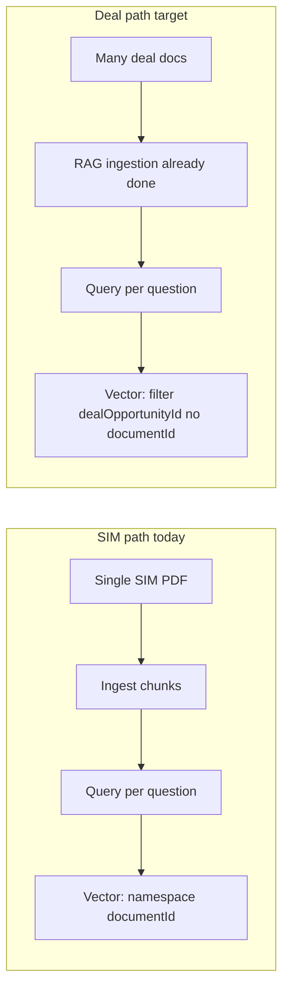

# Deal opportunity multi-document template screening

## Current behavior vs goal

- Today `[runAiScreening](apps/frontend/trpc/routers/deals.ts)` builds **structured text only from Postgres** (teaser, company, lead, financials) and calls `runAiQualitativeScreening`, then inserts into `[aiScreenings](packages/db/schema.ts)`. It does **not** use Vectorize or uploaded deal documents.
- SIM screening uses `[SimScreeningWorkflow](apps/frontend/src/workflows/sim-screening.workflow.ts)`: ingest **one** `SIM_SCREENING` PDF → chunks + Vectorize → per-question RAG with `searchDocumentChunksVector` scoped by `**documentId` (namespaced query).
- Deal uploads already run `[RagIngestionWorkflow](apps/frontend/src/workflows/rag-ingestion.workflow.ts)`; chunks carry `[dealOpportunityId` in metadata](apps/frontend/lib/document-chunk-vectorize.ts) (`vectorizeMetadataFromChunkRow`). `[searchDocumentChunksVector](apps/frontend/lib/document-chunk-vectorize.ts)` supports **multi-document** retrieval when `**documentId` is omitted: global query + metadata filter on `dealOpportunityId` (and optionally `entityType`).

## Decision 1: One workflow vs new workflow

**Recommendation: extend `SimScreeningWorkflow`**, not a second workflow.

- The **screen-questions** loop (embed question → `searchDocumentChunksVector` → prompt → `upsertSimScreeningAnswer` → progress) is identical.
- Only **validate-and-ingest** and **vector search inputs** differ. A discriminated payload (e.g. `scope: "sim_document" | "deal_opportunity"`) keeps one place for bugfixes and observability.

Add optional fields to `[SimScreeningParams](apps/frontend/src/workflows/workflow-env.ts)`, e.g. `dealOpportunityId?: string`, and treat presence of `dealOpportunityId` as the deal branch (or explicit `scope` enum for clarity).

## Decision 2: Data model for sessions

**Recommendation: extend `SimScreeningSession`**, not a parallel session table.

`[simScreeningSessions](packages/db/schema.ts)` today requires `documentId`. For deal-backed runs:

- Add nullable `**dealOpportunityId**` (FK → `dealOpportunities`).
- Make `**documentId` nullable.
- Add a **CHECK constraint**: exactly one of (`documentId`, `dealOpportunityId`) is non-null.

Downstream updates:

- `[insertSimScreeningSession](packages/db/mutations.ts)`: accept one of the two IDs.
- `[getSimScreeningSessionByIdForUser](packages/db/queries.ts)`, `[listSimScreeningSessionsForUserWithMeta](packages/db/queries.ts)`: join **either** `documents` **or** `dealOpportunities` for display labels (file name vs deal title).
- `[simScreening.startRun](apps/frontend/trpc/routers/sim-screening.ts)`: today loads `session.documentId` and requires that document `PROCESSED`. For deal sessions: **preflight** that there is RAG coverage for the deal, e.g. `count(*) from document_chunks where dealOpportunityId = ?` > 0 (and optionally require all deal-attached documents `ingestionStatus = PROCESSED` if you want strictness).

## Decision 3: Workflow branches

**Deal branch behavior:**

1. **Skip ingest** entirely (no Nextcloud fetch, no `SIM_SCREENING` check). Optionally set run to `SCREENING` quickly after lightweight validation.
2. **Preflight**: fail fast with a clear message if no chunks exist for that `dealOpportunityId` (user should wait for / retry RAG on uploads).
3. **Per-question retrieval**: call `searchDocumentChunksVector(db, index, { queryEmbedding, limit: RETRIEVAL_TOP_K_DEAL, dealOpportunityId, entityType: "DEAL_OPPORTUNITY" })` **without** `documentId`. Consider a slightly higher `limit` than 8 for multi-doc breadth (tunable constant).
4. **Auth**: SIM enforces `document.uploadedById === userId`. Deal path should enforce the **same deal access rules** as other `dealOpportunities` procedures (reuse existing permission checks from `[deals.ts](apps/frontend/trpc/routers/deals.ts)` patterns).

**SIM branch:** unchanged logic (keep `documentId` + namespace query + ingest/skipIngest).

## Decision 4: TRPC and entry point from the deal page

- Add a dedicated mutation (cleanest): e.g. `dealOpportunities.startTemplateScreening` with `{ dealOpportunityId, screenerId }` that:
  - Resolves the deal (including legacy id pattern like `runAiScreening`).
  - Authorizes the user.
  - Validates screener exists.
  - Creates `SimScreeningSession` (deal-backed) + `SimScreeningRun` + `insertWorkflowJob` + `startSimScreeningWorkflow` (same as `[simScreening.start](apps/frontend/trpc/routers/sim-screening.ts)`).
- **Alternative:** add `simScreening.startForDealOpportunity` in the sim router to keep all session creation in one module; either way the **deal page** calls one mutation.

Return `{ sessionId, runId, jobId, queueName }` like SIM so the client can dispatch `newJobs` and navigate to `[/cim-screening/$sessionId](apps/frontend/src/routes/_protected/cim-screening/$sessionId.tsx)`.

## Decision 5: UI

- Replace the plain `[RunAiScreeningButton](apps/frontend/components/deal-opportunities/run-ai-screening-button.tsx)` with a **dialog** mirroring `[cim-screening/index.tsx](apps/frontend/src/routes/_protected/cim-screening/index.tsx)` (screener `Select` + submit). Loader data for screeners: reuse `getAllScreeners()` via route loader, `useQuery`, or pass from parent if already loaded on the deal page.
- On success: same UX as SIM — toast, `newJobs` event, `navigate` to `/cim-screening/$sessionId?runId=…`.

## Decision 6: Session detail and index surfaces

- `[loadCimScreeningSessionData](apps/frontend/lib/server/cim-screening-route-data.ts)` and `[$sessionId.tsx](apps/frontend/src/routes/_protected/cim-screening/$sessionId.tsx)` assume a **single `document`**. Extend loader + UI:
  - If `session.documentId`: current behavior.
  - If `session.dealOpportunityId`: load deal row; show **“Deal opportunity”** card (name, link back to deal) instead of “Source document” / file meta; adjust copy from “SIM.pdf” defaults.

## Decision 7: Legacy qualitative `runAiScreening` / `aiScreenings`

The new flow writes **per-question answers** into `simScreeningAnswers`, not the aggregate JSON in `aiScreenings`. Choose explicitly:

- **A)** Remove or hide the old button-only qualitative path and rely on templates + session UI, **or**
- **B)** Keep qualitative screening as a **second** action (e.g. “Quick qualitative” vs “Template screening”) if product still wants the four-dimension summary without a template.

(Default implementation focus: **template path as primary**; qualitative can remain in TRPC unused until you decide.)

## Files to touch (summary)

| Area                  | Files                                                                                                                                                                                                          |
| --------------------- | -------------------------------------------------------------------------------------------------------------------------------------------------------------------------------------------------------------- |
| Schema + migration    | `[packages/db/schema.ts](packages/db/schema.ts)` (`SimScreeningSession`), new migration                                                                                                                        |
| Queries/mutations     | `[packages/db/queries.ts](packages/db/queries.ts)`, `[packages/db/mutations.ts](packages/db/mutations.ts)`                                                                                                     |
| Workflow types + impl | `[apps/frontend/src/workflows/workflow-env.ts](apps/frontend/src/workflows/workflow-env.ts)`, `[apps/frontend/src/workflows/sim-screening.workflow.ts](apps/frontend/src/workflows/sim-screening.workflow.ts)` |
| TRPC                  | `[apps/frontend/trpc/routers/deals.ts](apps/frontend/trpc/routers/deals.ts)` or `[sim-screening.ts](apps/frontend/trpc/routers/sim-screening.ts)`, plus `startRun` branch for deal sessions                    |
| Deal UI               | `[run-ai-screening-button.tsx](apps/frontend/components/deal-opportunities/run-ai-screening-button.tsx)`, possibly `[FetchDealAIScreenings.tsx](apps/frontend/components/FetchDealAIScreenings.tsx)` copy      |
| CIM session UX        | `[cim-screening-route-data.ts](apps/frontend/lib/server/cim-screening-route-data.ts)`, `[$sessionId.tsx](apps/frontend/src/routes/_protected/cim-screening/$sessionId.tsx)`                                    |

## Prerequisites / ops

- `[wrangler.jsonc](apps/frontend/wrangler.jsonc)` already documents metadata index for `dealOpportunityId`; ensure **production** index exists or filtered queries may return empty.
