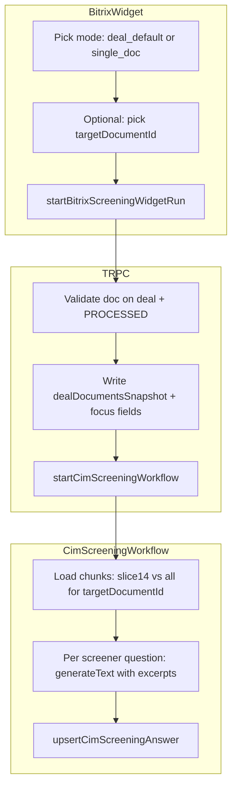

# Single-document (full-context) screening mode

## Current behavior (relevant facts)

- Cloudflare Workflow: [`apps/frontend/src/workflows/cim-screening.workflow.ts`](apps/frontend/src/workflows/cim-screening.workflow.ts).
- **Deal / Bitrix path** (`dealOpportunityId`): loads a **deterministic Postgres slice** via [`listDealOpportunityScreeningChunks`](apps/frontend/lib/document-chunk-vectorize.ts) with **`limit = 14`** — not per-question embedding search. Chunks are ordered by `documentId`, then `createdAt`, so **multi-file deals mix early chunks from several files**.
- **Library path** (`documentId`): per-question **Vectorize** retrieval (`RETRIEVAL_TOP_K = 8`).
- Bitrix widget starts runs from [`startBitrixScreeningWidgetRun`](apps/frontend/trpc/routers/deals.ts) → `startCimScreeningWorkflow` with `dealListingContextSource: "bitrix_live_snapshot"`.
- History today: [`cimScreeningSessions`](packages/db/schema.ts) (deal XOR library doc) + [`cimScreeningRuns`](packages/db/schema.ts) + optional [`dealDocumentsSnapshot` jsonb](packages/db/schema.ts) on the run.

## Recommended architecture (scalable, minimal duplication)

**1. Extend the existing `CimScreeningWorkflow` (preferred over a second Workflow binding)**  
A separate class file _named_ “single SIM screening” is optional for readability, but **one** Wrangler workflow ([`apps/frontend/wrangler.jsonc`](apps/frontend/wrangler.jsonc) already binds `CIM_SCREENING_WORKFLOW`) avoids duplicate bindings, shared progress/Bitrix comment logic, and drift between two loops.

Add explicit payload fields on [`CimScreeningParams`](apps/frontend/src/workflows/workflow-env.ts), for example:

- `screeningContextMode: "deal_default" | "deal_single_document_full"` (names flexible).
- `targetDocumentId?: string` — required when mode is `deal_single_document_full`; must belong to the deal (validate in TRPC + again in workflow).

**2. Chunk loading strategy inside the workflow**

- **Deal + single-doc mode**: query **all** `documentChunks` where `dealOpportunityId = payload.dealOpportunityId` **and** `documentId = targetDocumentId`, ordered consistently (e.g. `createdAt` or chunk sequence if present). **Do not** call `getEmbedding` / Vectorize for question retrieval.
- **Deal + default (today)**: keep existing `listDealOpportunityScreeningChunks` behavior for backward compatibility, or tighten later behind a feature flag.

**3. Context size / “full SIM” reality**

Concatenating **all** chunks into every question prompt can exceed model context. Practical pattern:

- Define a **hard character or token budget** (configurable env, e.g. `CIM_SCREENING_FULL_DOC_MAX_CHARS`).
- Concatenate chunks until the budget; if truncated, prepend a clear system note that the SIM was truncated (and log `truncated: true`).
- Long-term upgrade (if needed): a **two-phase** flow inside the same workflow (digest step → questions use digest + optional small excerpts), still one workflow class.

Reuse [`buildCimScreeningQuestionPrompt`](packages/ai-core) / [`buildExcerptsFromHits`](apps/frontend/src/workflows/cim-screening.workflow.ts) by building one synthetic “excerpts” string from the full-doc slice (same screener questions and scoring schema).

**4. Evidence fields**

- For full-doc mode, `evidenceChunkIds` can be **all chunk ids** used in the prompt window, or **empty** if you prefer not to imply retrieval; recommend **listing included chunk ids** (up to a cap) for traceability in the existing UI.

**5. History / audit**

- Extend the json already stored in `dealDocumentsSnapshot` when starting a Bitrix run: e.g. `focusedDocumentId`, `screeningContextMode`. No DB migration required (column is already `jsonb`).
- UI: when showing past runs, read snapshot to label “Single file: {fileName}” vs “Deal default”.

**6. API + UI (Bitrix widget)**

- [`bitrixScreeningWidgetStartRunSchema`](apps/frontend/lib/zod-schemas/deals-router.ts) (or adjacent): add optional `targetDocumentId` + mode (or derive mode from presence of `targetDocumentId`).
- [`startBitrixScreeningWidgetRun`](apps/frontend/trpc/routers/deals.ts): validate document belongs to deal and is `PROCESSED`; pass new fields into `startCimScreeningWorkflow`.
- [`bitrix-screening-widget-workspace.tsx`](apps/frontend/components/deal-opportunities/bitrix-screening-widget-workspace.tsx): toggle or segmented control **“All indexed deal documents (legacy slice)”** vs **“Single file (full text from this file)”**; dropdown populated from `d.dealDocuments` with processed docs; block start until selection when in single-file mode.

**7. Optional: main-app library CIM screening**

[`cim-screening` router](apps/frontend/trpc/routers/cim-screening.ts) could later accept the same `screeningContextMode` for `documentId` sessions (library path): **full chunks from that library document** vs current Vectorize-per-question. Same workflow branch pattern; can be phase 2.

---

## Auto-index new uploads?

**Recommendation: keep today’s behavior — always run the normal ingestion pipeline (chunks + Vectorize).**

Reasons:

- Single-doc full mode still **needs** `documentChunks` in Postgres; ingestion is required either way.
- Vectorize upsert is already part of ingestion; cost is incremental and keeps **one code path** for uploads.
- Users can still run **full-doc** screening on that file without retrieval; RAG remains available if you add library/deal vector modes later.
- Only skip vectorization if you introduce a dedicated **ephemeral** document type (extra product + cleanup complexity) — not needed for your described flow.

---

## Flow diagram

---

## Files to touch (implementation order)

1. [`apps/frontend/src/workflows/workflow-env.ts`](apps/frontend/src/workflows/workflow-env.ts) — extend `CimScreeningParams`.
2. [`apps/frontend/src/workflows/cim-screening.workflow.ts`](apps/frontend/src/workflows/cim-screening.workflow.ts) — branch chunk loading + skip embedding/Vectorize in single-doc mode; budget + logging.
3. [`apps/frontend/lib/zod-schemas/deals-router.ts`](apps/frontend/lib/zod-schemas/deals-router.ts) + [`apps/frontend/trpc/routers/deals.ts`](apps/frontend/trpc/routers/deals.ts) — validation, snapshot enrichment, pass payload.
4. [`apps/frontend/components/deal-opportunities/bitrix-screening-widget-workspace.tsx`](apps/frontend/components/deal-opportunities/bitrix-screening-widget-workspace.tsx) — mode UI + mutation args.
5. (If run labels in bootstrap) [`apps/frontend/lib/server/load-bitrix-screening-widget-bootstrap.ts`](apps/frontend/lib/server/load-bitrix-screening-widget-bootstrap.ts) — surface snapshot fields for history labels.
